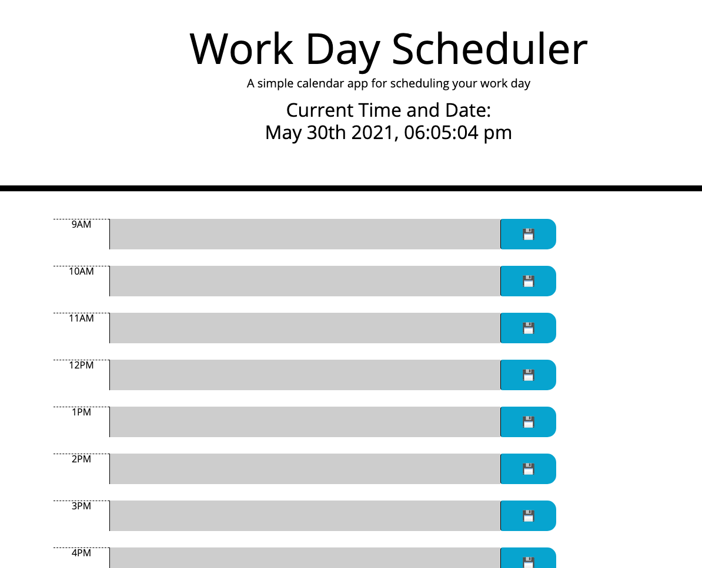

# Scheduler

## Overview

This is a scheduler that will allow user to put in a daily schedule for the average work day between 9 and 5. 
The scheduler also has current date and time displayed at the top of the screen.

# Future Development
The current hour is highlighted as red, while the hours that have yet to come are green. 
Time that has already passed is grey.
The user typed scheduler is saved in local storage and upon the site being refreshed, the saved items will reappear. 

# Deployed Website
https://aydanegash.github.io/scheduler/ 

# ## License & copyright

Licensed under [MIT License](License).